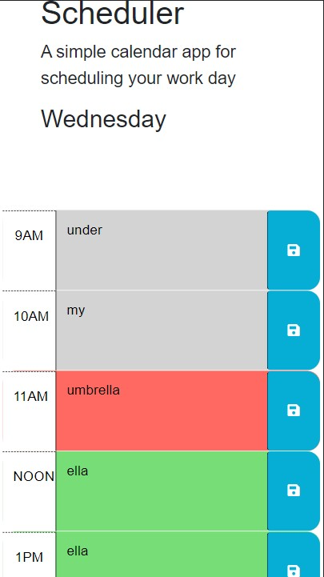

# daily-calendar
a calendar application that allows a user to save events for each hour of the day

## Description
This is a daily calendar that saves your items by hour and updates color-coded blocks based on past, present and future events. The current day of the week is displayed at the top of the page. 

## Installation
Website is available here: https://lileeeeeee.github.io/daily-calendar and looks like this:

## Usage
When the page is loaded, any previously saved items will load. The color-coded blocks will update based on the current hour, displaying gray for past, red for current and green for future. When the save button is clicked on any block, that item will be saved in the corresponding time block. Items can be cleared by deleting the existing text and clicking save. This application uses jQuery and Day.js libraries. 

Credits
N/A

License
See License